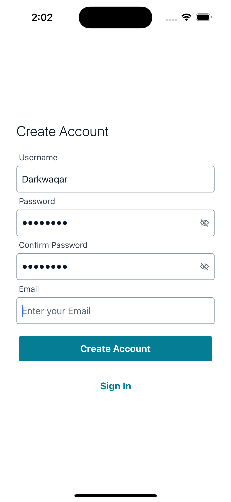
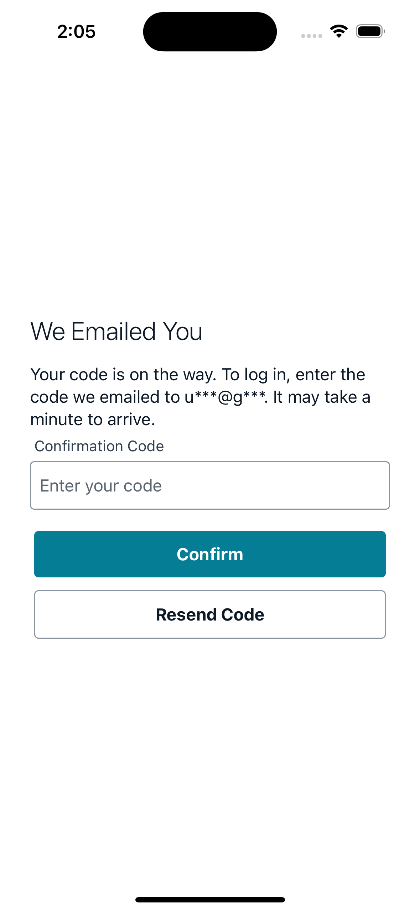
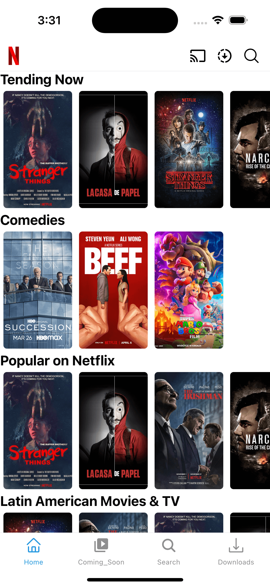
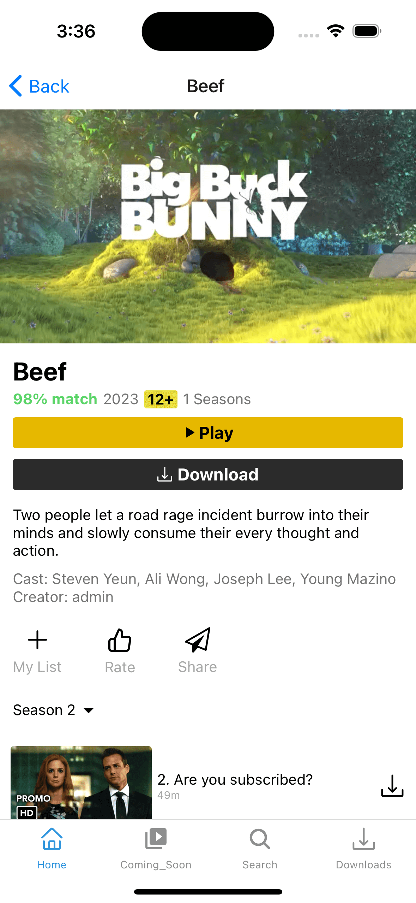
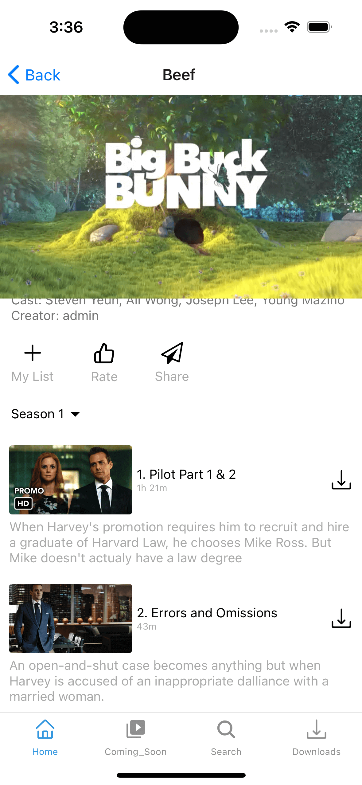

# Clone of NetFlix

## React Native | Typescript | Expo cli | Amplify | Amplify Auth | Amplify UI |Amplify api | Graphql| Splash Screen | React Navigation | Bottom Tab Navigation | Expo Linking | Expo Web Browser | Azure Polyfill | Expo-av | Model DropDown

# Steps

1. use `npx create-expo-app -t expo-template-blank-typescript` this will init the project in typescript
2. add the web support `npx expo install react-dom react-native-web @expo/webpack-config`
3. add amplify `yarn add aws-amplify amazon-cognito-identity-js @react-native-community/netinfo @react-native-async-storage/async-storage core-js`
4. init the amplify `amplify init`
5. add amplify auth `amplify add auth`

- select Default configuration.
- select username as the default auth
- yes i am done -
- then amplify push
  -yes

6. add to app.js

```
import { Amplify, Auth } from "aws-amplify";
import awsConfig from "./src/aws-exports";
Amplify.configure(awsConfig);
```

7. add aws-amplify-ui

```
yarn add @aws-amplify/ui-react-native aws-amplify react-native-safe-area-context amazon-cognito-identity-js @react-native-community/netinfo @react-native-async-storage/async-storage react-native-get-random-values react-native-url-polyfill
```

8. in app.js

```
import { Authenticator, useAuthenticator } from "@aws-amplify/ui-react-native";
<Authenticator.Provider>
    <Authenticator>
    </Authenticator>
</Authenticator.Provider>
```

9. add the splash-screen
   `npx expo install expo-splash-screen`

10. add React Navigation both native and stack `yarn add @react-navigation/native @react-navigation/stack @react-navigation/bottom-tabs`

11. add expo react navigation decencies and add gesture handle `npx expo install react-native-screens react-native-safe-area-context react-native-gesture-handler`

12. add expo linking `npx expo install expo-linking`

13. add api with amplify with `amplify add api`
    we use graphQl

- then select provide api name : instagram-clone
- then select authorization type : Amazon Cognito User Pool
- configure more auth type :n
- enable conflict detection :yes
- default resolution : auto Merge
- select One-to-many relationship
- do you want to edit scheme : y
- generate code with `amplify codegen`

14. add web expo browser
    `npx expo install expo-web-browser`

15. got into issue https://github.com/aws-amplify/amplify-js/issues/8176
    `yarn add @azure/core-asynciterator-polyfill`
    and most importantly do not forget to import the package before any other imports in your app.tsx file:
    `import '@azure/core-asynciterator-polyfill'`

16. add picker
    `yarn add @react-native-picker/picker`

17. add av for video player
    `npx expo install expo-av`

18. add dialog picker dont look good in ios
    `yarn add react-native-modal-dropdown`

# preview

| Login                        | Send Code                    | Home                         |
| ---------------------------- | ---------------------------- | ---------------------------- |
|  |  |  |
|  |  |
